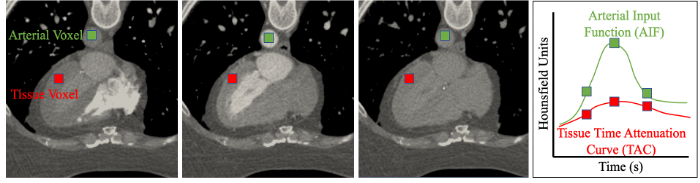

# ImageAnalysisTools
The scripts in this repository provide useful tools to analyze medical images. You will need to set up the following libraries for majority of these scripts:
1. vtk 
2. vmtk (see www.vmtk.org)
3. numpy
4. scipy

## 1.0 Dynamic CTA Perfusion Analysis
Dynamic CT Myocardial Perfusion Imaging (CT-MPI) is an advanced imaging modality that can be used to image the blood flow inside myocardial tissue. The image acquistion pipeline generally involves four steps: i) inducing vasodilator-mediate hypermia followed by injection of iodine-based contrast agent; ii) scanning myocardium for 20-30 seconds, providing ~15 time points during the passage of contrast; iii) extracting time attenuation curves in an artery (typically ascending aorta) and myocardium; and iv) calculating myocardial blood flow using a tracer kinetic model. 

 

### 1.1 Quantifying Vessel-Specific Myocardial Territories.
 You may use the following pipeline to separate the myocardium into territories based on proximity to a coronary vessel. These territorty maps are useful to determine vessel-specific ischemia, assign boundary conditions or compute vessel-specific myocardial mass. You will need the following three items to perform this analysis:
1.  

The following pipeline can be used to analyze these volumetric images. 
